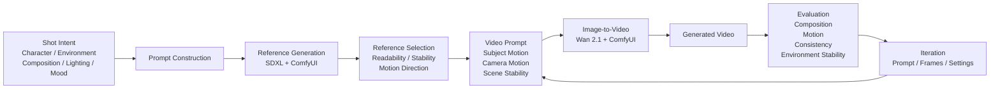

- ComfyUI는 노드 기반으로 이미지 생성 파이프라인을 구성하는 도구다.
- 최소 workflow는 Checkpoint 로드 → Prompt 인코딩 → Sampling → Decode → Save 흐름으로 이해할 수 있다.
- 같은 장면 조건을 유지한 채 seed를 변경하면 reference image variation을 만들 수 있다.

## DAY2 — Prompt Control & Shot Design

동일한 Scene에서 Composition Prompt와 Seed가 결과에 미치는 영향을 비교했다.

- Prompt를 Character / Environment / Composition / Lighting / Mood로 구조화
- 동일 Seed에서 Composition만 변경해 Establishing / Side Profile / Follow Shot 생성
- 동일 Prompt에서 Seed만 변경해 Shot consistency 확인
- Img2Img를 적용해 Reference Image 기반 refinement와 variation 실험

### Key Findings

- Prompt는 Shot의 큰 방향과 Composition을 제어할 수 있다.
- Seed는 플랫폼 구조, 캐릭터 스타일, 세부 배치에 큰 영향을 준다.
- Img2Img는 기존 Shot 구조를 유지하면서 세부 변형을 주는 데 효과적이었다.
- Denoise 0.35는 refinement, 0.55는 controlled variation에 더 적합했다.

### Workflow

Shot Specification  
→ Prompt Construction  
→ Generation  
→ Evaluation  
→ Iteration

## DAY3 — Image-to-Video Generation

DAY3에서는 DAY2에서 선택한 Reference Image를 실제 Video Shot으로 연결해 첫 End-to-End AI Content Generation 경로를 완성했습니다.

### Workflow

Shot Intent
→ Reference Image
→ Video Prompt
→ Wan 2.1 Image-to-Video
→ Generated Video
→ Evaluation
→ Iteration

### Environment

- ComfyUI Desktop
- Wan 2.1 Image-to-Video
- NVIDIA RTX 4060 8GB
- 512 × 512
- 16 FPS

### Experiments

#### 1. Incorrect Prompt Test

Reference Image와 전혀 다른 Prompt를 실수로 입력한 상태에서 영상을 생성했습니다.

Prompt:
a cute anime girl with massive fennec ears and a big fluffy tail wearing a maid outfit turning around

그럼에도 불구하고 지하철 플랫폼, 중앙 후면 구도, 깊은 원근감 등 Reference Image의 주요 구조가 상당 부분 유지되었습니다.

→ 짧은 I2V 생성에서는 Text Prompt보다 Start Image가 Scene Identity와 Composition에 강한 영향을 주는 것을 확인했습니다.

#### 2. Motion Prompt Test

Video Prompt를 Scene Description보다 Motion 중심으로 수정했습니다.

Prompt:
A young woman walks away from the camera on an empty subway platform.
Maintain a centered rear composition and strong deep perspective.
Subtle forward camera movement, as if the camera is gently following her.
Slow, controlled cinematic motion.
Stable subway environment.

33 frames / 16 FPS 기준 약 2초 영상 생성에 성공했습니다.

#### 3. Motion Iteration

Motion Intent를 더 명확하게 표현하고, Frame 수를 33 → 49로 늘렸습니다.

- 33 frames → 약 2.06 sec
- 49 frames → 약 3.06 sec

Composition과 Environment Stability를 유지하면서 움직임을 평가하기 위한 시간적 여유가 늘어났습니다.

### Key Findings

- Reference Image는 Video Generation에서 Scene Identity와 Composition을 유지하는 강한 조건으로 작동했습니다.
- Video Prompt는 Scene 자체를 다시 설명하기보다 Subject Motion / Camera Motion / Motion Speed를 지정하는 데 더 적합했습니다.
- Prompt 수정만으로 Motion을 완전히 제어하기에는 한계가 있었으며, 향후 Motion Control 또는 다른 Video Model 비교가 필요합니다.

### Result

첫 End-to-End 생성 경로를 실제로 완성했습니다.

Reference Image
→ Wan 2.1 I2V
→ Video Prompt
→ Generated Video
→ Evaluation
→ Iteration

대표 결과:
videos/subway_follow_motion_v2.mp4

Workflow:
workflows/wan_i2v_subway_follow.json

### End-to-End Pipeline

# DAY4 — Workflow Productization & End-to-End Pipeline

## Goal

DAY1~3에서는 Image / Video Generation 과정을 직접 조작하며 생성 모델의 특성과 한계를 실험했다.

DAY4에서는 다음 질문에서 출발했다.

> 사람이 반복하던 AI Shot 제작 과정을 구조화된 입력 기반의 반복 가능한 Workflow로 바꿀 수 있는가?

목표는 새로운 생성 모델을 만드는 것이 아니라, Creator Intent를 구조화하고 Reference Image Generation부터 Image-to-Video까지 이어지는 Local AI Content Generation Pipeline을 직접 구현하는 것이었다.

---

## Before — Manual Workflow

Shot Intent  
→ Prompt 직접 작성  
→ ComfyUI 실행  
→ Node 직접 수정  
→ Queue  
→ Output 확인  
→ Prompt 수정  
→ 반복

각 Shot마다 사람이 동일한 작업을 반복해야 했다.

---

## After — Structured Workflow

ShotSpec  
→ Prompt Builder  
→ Image Prompt / Video Prompt  
→ Reference Candidate Generation  
→ Creator Selection  
→ Selected Reference  
→ Wan 2.1 Image-to-Video  
→ Video Shot

생성 과정의 반복 작업은 코드로 분리하고, 창작자의 선택이 필요한 지점은 Human-in-the-loop로 유지했다.

---

## ShotSpec v0.2

Shot의 제작 의도를 JSON 형태로 구조화했다.

주요 요소:

- Character
- Environment
- Composition
- Lighting
- Mood
- Motion

Motion은 Image-to-Video 실험 결과를 반영하여 다음과 같이 분리했다.

- Subject Motion
- Camera Motion
- Motion Speed
- Scene Stability
- Composition Preservation

이를 통해 특정 Scene을 코드에 직접 작성하는 대신 Shot의 의도를 데이터로 전달할 수 있도록 구성했다.

---

## Prompt Builder

`src/prompt_builder.py`

ShotSpec을 읽어 Image와 Video Generation에 필요한 Prompt를 각각 별도로 생성한다.

### Image Prompt

다음 정보를 중심으로 구성한다.

- Subject
- Action
- Orientation
- Environment
- Composition
- Environment Details
- Lighting
- Mood

### Video Prompt

다음 정보를 중심으로 구성한다.

- Subject Motion
- Camera Motion
- Motion Speed
- Scene Stability
- Composition Preservation

Image와 Video Model에 동일한 Prompt를 사용하는 대신, 각 생성 단계의 역할에 맞는 정보를 분리했다.

---

## Reusable Shot Pipeline

서로 다른 두 ShotSpec을 동일 코드에서 처리했다.

- `subway_follow_01.json`
- `rainy_alley_01.json`

Prompt Builder 및 Generation 코드를 수정하지 않고 입력 ShotSpec만 변경하여 서로 다른 Scene을 처리했다.

이를 통해 특정 장면에 하드코딩된 Workflow가 아니라 입력을 교체할 수 있는 구조임을 검증했다.

---

## Reference Image Generation

기존에 검증한 SDXL Text-to-Image ComfyUI Workflow를 API Template으로 재사용했다.

Python에서는 Workflow 자체를 새로 생성하지 않고 다음 값만 주입한다.

- Positive Prompt
- Negative Prompt
- Seed
- Output Prefix

전체 흐름:

ShotSpec  
→ Image Prompt  
→ ComfyUI API Workflow  
→ Reference Candidate

이후 Shot당 Seed가 다른 3개의 Candidate를 생성하도록 확장했다.

---

## Creator Selection

AI가 최종 Reference를 자동 평가하도록 만들지 않았다.

Candidate 01  
Candidate 02  
Candidate 03  
→ Creator Selection  
→ Selected Reference

생성 자체는 자동화하되 Shot의 최종 시각적 판단은 Creator에게 남겼다.

이는 AI가 창작 판단을 대신하는 것이 아니라 반복적인 제작 과정을 줄이기 위한 Human-in-the-loop 구조다.

---

## Image-to-Video

Creator가 선택한 Reference와 ShotSpec에서 생성된 Video Prompt를 Wan 2.1 Image-to-Video Workflow에 연결했다.

Selected Reference  
+ Video Prompt  
→ Wan 2.1 I2V  
→ Video Shot

최종 테스트 환경:

- Resolution: 512 × 512
- Frames: 49
- FPS: 16
- Duration: 약 3초
- GPU: NVIDIA RTX 4060 8GB

Local 환경에서 Reference Image → Video Shot까지 End-to-End 생성에 성공했다.

---

## Troubleshooting — Denoise

초기 Reference Image Generation 결과에서 이미지가 흐릿하고 Scene 구조가 제대로 형성되지 않는 문제가 발생했다.

처음에는 Prompt 문제로 판단했지만, Workflow를 점검한 결과 Text-to-Image Workflow의 KSampler에 Img2Img 실험에서 사용한 `denoise = 0.55`가 남아 있었다.

변경 전:

denoise 0.55  
→ 흐릿한 형태  
→ 낮은 Scene Fidelity  
→ 인물과 공간 구조가 불명확

변경 후:

denoise 1.0  
→ Subject 표현 개선  
→ Environment 구조 개선  
→ Perspective 개선  
→ 전체 이미지 선명도 향상

이를 통해 생성 결과의 품질은 Prompt뿐 아니라 다음과 같은 전체 Generation Workflow의 영향을 받는다는 점을 확인했다.

- Model
- Seed
- Sampler
- Scheduler
- Denoise
- Resolution
- Conditioning

---

## Key Findings

### 1. Prompt Engineering만으로 생성 결과를 설명할 수 없다

동일한 Prompt에서도 Seed와 Workflow Parameter에 따라 Composition과 Scene Detail이 크게 달라졌다.

Prompt 자체뿐 아니라 생성 환경 전체를 함께 점검해야 했다.

### 2. Image Prompt와 Video Prompt의 역할은 다르다

Image Prompt는 한 Frame의 시각적 구성을 정의하고, Video Prompt는 시간에 따른 Motion을 정의해야 했다.

따라서 두 Prompt를 하나로 통합하기보다 목적에 맞게 분리했다.

### 3. 완벽한 한 장보다 Candidate Generation이 현실적이다

Text-to-Image만으로 정확한 Camera / Composition Control에는 한계가 있었다.

따라서 하나의 결과를 완벽하게 통제하려 하기보다 여러 Candidate를 생성하고 Creator가 선택하는 방식이 실제 제작 Workflow에 더 적합하다고 판단했다.

### 4. Creator 판단과 반복 작업을 분리할 수 있다

Reference Generation과 Workflow Execution은 자동화하되 최종 Reference Selection은 Creator에게 남겼다.

반복 작업을 자동화하면서도 핵심 창작 판단은 사람에게 유지하는 구조를 만들 수 있었다.

---

## Limitations

현재 Pipeline은 Production 수준의 AI Video System이 아니다.

다음과 같은 한계가 있다.

- SDXL Base / Wan 2.1 Local 결과 품질의 한계
- ShotSpec을 직접 JSON으로 작성해야 함
- Candidate Selection은 수동
- 일부 File Staging 과정이 수동 또는 환경 의존적
- ComfyUI Node ID에 의존하는 API Integration
- 정확한 Camera / Motion Control의 한계
- Model Routing 미구현
- 자동 품질 평가 미구현
- Motion Consistency 한계

특히 최종 영상의 Visual Quality와 Motion Consistency는 상용 AI Video Model과 비교하면 부족했다.

---

## Why This Project Matters

이 프로젝트의 목적은 기존 상용 Workflow보다 더 좋은 AI 영상 생성 시스템을 만드는 것이 아니었다.

기존 AI 생성 도구를 단순히 사용하는 것에서 벗어나 다음 과정을 직접 분해하고 구현하는 것이 목표였다.

Creator Intent  
→ Structured Specification  
→ Prompt Construction  
→ Generation  
→ Candidate Selection  
→ Video Generation

이를 통해 AI Content Generation에서 어떤 작업을 자동화할 수 있고, 어떤 판단을 Creator에게 남겨야 하며, Prompt뿐 아니라 전체 Generation Pipeline이 결과 품질에 영향을 준다는 점을 직접 검증했다.

특히 단순한 Prompt 작성에서 끝나는 것이 아니라 Creator Intent를 구조화된 데이터로 변환하고, 이를 실제 생성 Workflow와 연결하는 과정을 구현했다는 점에 의미가 있다.

---

## Final Outcome

DAY1~3에서 수동으로 수행하던 Shot 제작 과정을 ShotSpec 기반으로 구조화했다.

Python Prompt Builder와 ComfyUI API를 연결하여 다음과 같은 반복 가능한 Local AI Content Generation Workflow를 구현했다.

ShotSpec  
→ Image Prompt / Video Prompt  
→ Reference Candidates  
→ Creator Selection  
→ Selected Reference  
→ Image-to-Video  
→ Video Shot

생성 결과의 품질에는 명확한 한계가 있었지만, AI 모델을 단순 호출하는 수준에서 벗어나 Creator Intent와 Generation Tool 사이를 연결하는 Workflow 설계 및 자동화를 직접 구현했다.

최종적으로 이 프로젝트를 통해 다음을 확인했다.

- AI 콘텐츠 생성은 Prompt 하나의 문제가 아니다.
- Model과 Workflow Parameter가 결과 품질에 큰 영향을 준다.
- 정확한 자동 제어보다 Candidate Generation + Creator Selection 구조가 현실적일 수 있다.
- 반복 작업과 창작 판단을 분리하면 Human-in-the-loop 기반 Workflow를 구성할 수 있다.
- 생성 모델을 직접 개발하지 않더라도 여러 AI 생성 단계를 연결하고 구조화하는 것이 AI Content Builder의 중요한 역할 중 하나다.